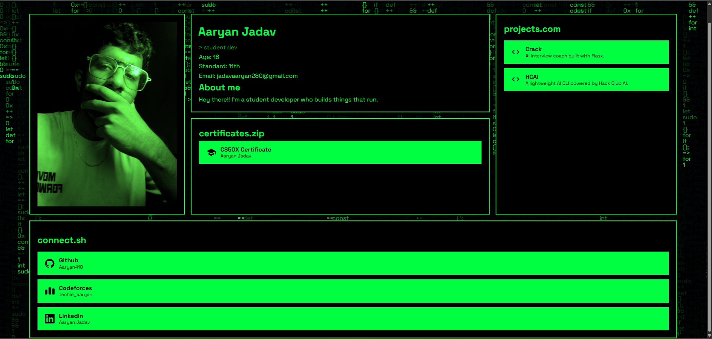

# My Personal Website
- Hey there!! My name is Aaryan Jadav and this is my personal website. 

## Built with
- HTML -> page structure
- CSS -> layout, and some animations
- JS -> the code rain, typing effect below my name and glitch animation on my name.

Just plain HTML, CSS and JS site deployed.

## Image

## Theme
- It is hacker-terminal-based personal portfolio site, with black and green colors since it looks cool and also fits in my interest like ML and Cybersecurity.
- So its just black and green the whole website.
- You will also see random codes falling at the behind on the pitch black background.
- It has Space Grotesk font.

## Contents
- Well i have provieded my email address.
- Also i have showed my achievements, you can see the certificates box.
- At the bottom i have links to my social accounts.
- At the right side i have my projects that i have completed.
- Well hover onto my photo to see the actual photo of mine with original photo color (which is green right now).

## Features
- Full-viewport layout built with CSS Grid, responsive across computer, tablet and phone.
- Canvas-based code falling effect in the background.
- Typing effect, basically like terminal.
- Glitch effect on my name.

## Run locally
- run "git clone https://github.com/Aaryan410/Aaryan"
- and just directly run the index.html by double clicking the file on your computer.

## License
- Has the classic MIT License
- So feel free to use it as a template for your personal site!!! 
